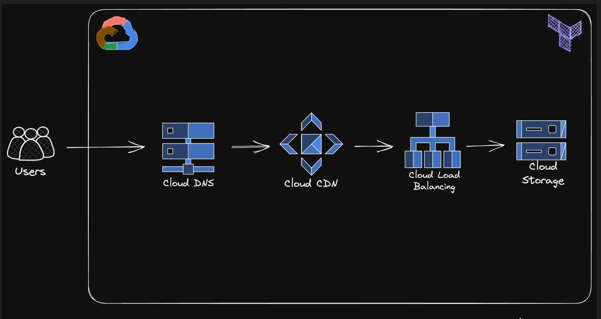

# GCP and Terraform

Hi, welcome the "Deploy Infrastructure to GCP with Terraform".  We deploy a static website to GCP using Terraform. My GitHub repo containing the code both for the static website and Terraform as Infrastructure as Code.

## Architecture

## Code

The Terraform code is available under the `infra` directory. And the website code is available under the `website` directory.

